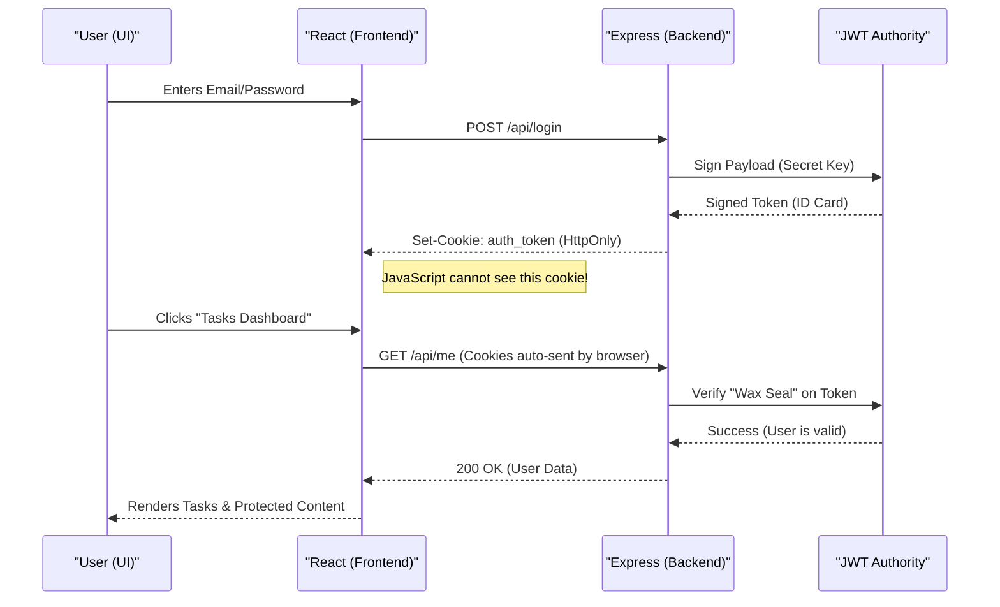
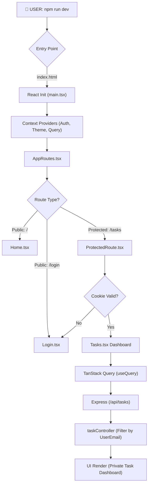

# Pro Task Manager (React + TypeScript + Vite)

🚀 **Live Demo:** [my-task-manager.vercel.app](https://my-task-manager-1cgpe34a3-dhayananth1511-5577s-projects.vercel.app)

A modern, high-performance task management application built as a comprehensive learning journey from basic React to production-grade patterns.

## Performance-Oriented Tech Stack
- **Framework**: React 19 + TypeScript
- **Bundler**: Vite (Ultra-fast build tool)
- **Routing**: React Router 7 (Single Page Navigation)
- **State Management**: Zustand (Primary), Redux Toolkit (Secondary)
- **Data Fetching**: TanStack Query v5 (Server State & Caching)
- **Forms & Validation**: React Hook Form + Zod
- **Analytics**: Chart.js (Data Visualization)
- **Persistence**: Zustand Persist (localStorage Sync)
- **Backend Architecture**: Express.js (Modular/Service-based Pattern)
- **Styles**: Tailwind CSS v4 (Utility-first with Glassmorphism)
- **Auth**: Secure JWT + HttpOnly Cookies (XSS-Proof)

---

## 📚 Study Handbook & Concept Deep-Dive

This project is accompanied by a **Complete Concept Handbook**: [Material.md](./Material.md).

If you are following this project as a learning journey, the handbook provides the "Why" and "How" behind every architectural decision, including internal logic, code examples, project usage, and common interview questions for:
- **React Advanced**: Hooks (Deep-dive), Refs, Context, and Error Boundaries.
- **Optimization**: React.memo, useMemo, and useCallback.
- **State Management**: Context API vs. Redux Toolkit vs. Zustand.
- **Data Handling**: Async/Await, TanStack Query, and Error Handling.
- **Security**: Environment Variables, JWT Authentication, and Password Hashing.
- **Validation**: Strict Schema Validation with Zod (Frontend & Backend).
- **Deployment**: Full-stack Vercel Bridge and Cloud Architecture.
- **UX**: Responsive Design and Accessibility.

---

## The Complete Learning Roadmap

### Phase 1: Foundations & Architecture
**Step 1: Clean Project Structure**
- *Goal*: Remove boilerplate and organize folders.
- *Why*: Makes the codebase scalable and follows industry "Separation of Concerns."

**Step 2: Create Page Components**
- *Goal*: Build initial views (Home, Tasks, TaskDetail, Settings).
- *Why*: Pre-defining views before implementing navigation logic.

**Step 3: Install React Router**
- *Goal*: Add `react-router-dom`.
- *Why*: Enables Single Page Application (SPA) behavior where the page updates without refreshing the browser.

**Step 4: Setup App Routes**
- *Goal*: Configure the route table.
- *Why*: Maps specific URLs (e.g., `/tasks`) to their respective components.

**Step 5: Create Global Navbar**
- *Goal*: Implement a persistent navigation bar.
- *Why*: Provides consistent user experience across all routes.

---

### Phase 2: React Hooks & Logic
**Step 6: useState (The Heart of React)**
- *Goal*: Manage local task and input states.
- *Why*: Allows the UI to react instantly to user input.

**Step 7: Task Logic (CRUD Foundations)**
- *Goal*: Implement adding and listing logic.
- *Why*: Teaches immutable state updates (using `...` spread operator).

**Step 8: useEffect (Life Cycle Management)**
- *Goal*: Handle component mounting and side effects.
- *Why*: Used for API calls, subscriptions, or initial page logging.

**Step 9: Dynamic Routing (useParams)**
- *Goal*: Create parameterized routes like `/tasks/:id`.
- *Why*: Allows a single "Detail" component to render unique content based on the URL.

---

### Phase 3: Global State Management
**Step 10: Context API (The Prop-Drilling Killer)**
- *Goal*: Implement `ThemeContext`.
- *Why*: Avoids passing "Theme" props through every single child component.

**Step 11: Dark Mode Implementation**
- *Goal*: Build a global theme toggle.
- *Why*: Demonstrates real-world usage of global context to influence styling.

**Step 12: Redux Toolkit (The Industry Standard)**
- *Goal*: Centralize task management in a Redux Store.
- *Why*: Scales better for large teams and complex state logic.

**Step 13: Zustand (The Modern Alternative)**
- *Goal*: Implement a lightweight store using Zustand.
- *Why*: Offers much less boilerplate than Redux while maintaining global accessibility.

---

### Phase 4: Reliability & Optimization
**Step 14: Error Boundary**
- *Goal*: Implement a class-based error catcher.
- *Why*: Prevents the entire app from crashing if a small part of the UI fails.

**Step 15: React.memo (Render Optimization)**
- *Goal*: Memoize the `TaskCard` component.
- *Why*: Saves CPU by skipping re-renders of components whose props haven't changed.

**Step 16: useMemo (Calculation Caching)**
- *Goal*: Cache filtered search results.
- *Why*: Prevents expensive filtering logic from running on every keystroke if the list hasn't changed.

**Step 17: useCallback (Reference Stability)**
- *Goal*: Wrap event handlers passed to memoized children.
- *Why*: Without this, `TaskCard` would re-render because functions are re-created every time.

---

### Phase 5: Production Quality & Inspection
**Step 18: Chrome DevTools**
- *Goal*: Master the Console, Network, and Performance tabs.
- *Why*: Critical for identifying slow logic or failed network requests.

**Step 19: React Developer Tools**
- *Goal*: Inspect high-level hooks, state, and props tree.
- *Why*: Visualizes how data flows through your React components.

**Step 20: Lighthouse Audit**
- *Goal*: Audit for SEO, Accessibility, and Performance.
- *Why*: Ensures the final product is professional, fast, and accessible to everyone.

---

### Phase 6: Advanced API Consumption
**Step 21: Environment Variables (.env)**
- *Goal*: Externalize API URLs and configuration.
- *Why*: Keeps sensitive settings out of source code and allows multiple environments (Dev/Prod).

**Step 22: Async/Await Service Layer**
- *Goal*: Implement clean data fetching with `try/catch`.
- *Why*: Makes asynchronous code readable and provides robust error handling.

**Step 23: TanStack Query (Server State)**
- *Goal*: Implement `useQuery` for fetching and caching.
- *Why*: Eliminates boilerplate for loading/error states and adds intelligent data synchronization.

**Step 24: Loading & Error Patterns**
- *Goal*: Implement spinners and user-friendly error messages.
- *Why*: Improves UX by keeping the user informed of the app's current network state.

**Step 25: React Query DevTools**
- *Goal*: Inspect network cache and stale data.
- *Why*: Powerful tool for debugging complex data flows and cache invalidation.

---

### Phase 7: Advanced Forms & Validation
**Step 26: React Hook Form**
- *Goal*: Eliminate manual state management for every input.
- *Why*: Improves performance by reducing re-renders and simplifies code structure.

**Step 27: Zod Schema Validation**
- *Goal*: Define data rules in a single, reusable schema.
- *Why*: Ensures data integrity and provides instant, type-safe error feedback to the user.

**Step 28: Complex Field Handling**
- *Goal*: Implement multi-field forms (Priority, Description) with validation.
- *Why*: Demonstrates real-world form complexity beyond simple text inputs.

---

### Phase 8: Data Analytics & Persistence
**Step 29: Data Visualization (Chart.js)**
- *Goal*: Render a Pie Chart of task statistics.
- *Why*: Provides at-a-glance context on productivity that raw numbers cannot convey.

**Step 30: Zustand Persistence**
- *Goal*: Sync the application state with `localStorage`.
- *Why*: Prevents data loss on page refresh, making the app feel like a real production tool.

---

### Phase 9: Industrial Backend & Security
**Step 31: Modular Express Architecture**
- *Goal*: Separate logic into Controllers, Services, and Routes.
- *Why*: Mirrors company-level project structures used at Google, Netflix, etc.

**Step 32: Secure JWT (HttpOnly Cookies)**
- *Goal*: Store session tokens in a browser-locked cookie vault.
- *Why*: Protects users from XSS attacks that could steal their identity.

**Step 33: Auth Middleware & Protected Routes**
- *Goal*: Block unauthenticated users from seeing sensitive data.
- *Why*: Ensures that only verified "Active ID Cards" can open the Dashboard.

---

### Phase 10: Scalable UI & Modern CSS
**Step 34: Migration to Tailwind CSS v4**
- *Goal*: Refactor custom CSS into utility-first classes.
- *Why*: Faster development speed and guaranteed design consistency.

**Step 35: App/Server Split Pattern**
- *Goal*: Separate the App logic (`app.js`) from the network startup (`server.js`).
- *Why*: Critical for enterprise testing and high-availability deployments.

---

### Phase 11: Real-World Data Privacy & Hashing
**Step 36: Bcrypt Password Encryption**
- *Goal*: Never store raw passwords. Use salt-based hashing.
- *Why*: Even if the server is hacked, user passwords remain unreadable and safe.

**Step 37: Multi-User Task Isolation**
- *Goal*: Ensure User A can never see or modify User B's tasks.
- *Why*: Privacy is a non-negotiable requirement for any professional production app.

**Step 38: Model Abstraction Pattern**
- *Goal*: Separate the data storage (Models) from the behavior (Controllers).
- *Why*: Allows the app to switch from in-memory arrays to MongoDB/PostgreSQL effortlessly.

---

### Phase 12: Developer Experience & Organization
**Step 39: Path Aliasing (@/)**
- *Goal*: Replace messy relative imports with a clean `@/` prefix.
- *Why*: Improves code readability and makes refactoring painless.

**Step 40: Unified Environment Hub**
- *Goal*: Consolidate Frontend and Backend configuration into a single root `.env` file.
- *Why*: Provides a single "Source of Truth" for the entire project.

---

### Phase 13: Industrial Hardening & Performance
**Step 41: Robust Backend Validation (Zod)**
- *Goal*: Secure the server by strictly validating `req.body` using Zod schemas.
- *Why*: Ensures only clean, expected data reaches your controllers.

**Step 42: Modern Data Fetching Refactor**
- *Goal*: Replace manual loading/fetch states with TanStack Query.
- *Why*: Automates caching, background sync, and UI state management.

**Step 43: Strict Type Enforcement**
- *Goal*: Configure `verbatimModuleSyntax` and explicit `import type` patterns.
- *Why*: Optimizes build size and ensures separation between values and types.
---

### Phase 14: Cloud Deployment & Full-Stack Automation
**Step 44: TypeScript 6.0 Compatibility**
- *Goal*: Resolve modern `baseUrl` deprecations and build-time safety.
- *Why*: Ensures the codebase can be built by strict CI/CD pipelines (like Vercel).

**Step 45: Full-Stack Vercel Bridge**
- *Goal*: Create an `api/` entry point and `vercel.json` rewrites.
- *Why*: Allows a standard Express server to run alongside a React frontend on a single serverless domain.

---

## 🔄 The Secure Authentication Workflow

Below is the complete architectural loop of how a user's identity is verified from the login click to the final dashboard render.



## 🏗️ Application Execution Flow

This chart traces exactly what happens when you run `npm run dev` and how data flows through the system.



## 🌍 Production Deployment (Vercel)

This project is optimized for "Full-Stack" deployment on Vercel using Serverless Functions.

### 1. The Bridge Architecture
We use a **Bridge Pattern** where `api/index.js` imports your Express `app.js`. This allows you to keep your modular backend structure while letting Vercel handle the scaling.

### 2. Deployment Steps
1. **Install CLI**: `npm install -g vercel`
2. **Login**: `vercel login`
3. **Deploy**: `vercel --prod`

### 3. Required Environment Variables
You MUST add the following keys in the **Vercel Dashboard (Settings > Environment Variables)** for the backend to function:
- `JWT_SECRET`: Your private key.
- `COOKIE_NAME`: `auth_token`
- `JWT_EXPIRES_IN`: `1h`
- `COOKIE_MAX_AGE`: `3600000`


## Getting Started

1. **Clone and Install**
   ```bash
   npm install
   cd server && npm install
   ```

2. **Configure Environment**
   Create a `.env` file in the **root** folder:
   ```env
   # Backend
   PORT=5000
   JWT_SECRET=your_secret_key
   COOKIE_NAME=auth_token
   JWT_EXPIRES_IN=1h
   COOKIE_MAX_AGE=3600000
   ```

3. **Run for Development**
   Open two terminals:
   ```bash
   # Terminal 1: Frontend
   npm run dev

   # Terminal 2: Backend
   npm run dev --prefix server
   ```

4. **Deploy to Production**
   ```bash
   vercel --prod
   ```

Deploying now!
